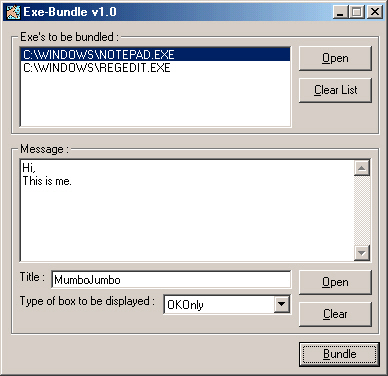



## ExeBundle v1\.0

### Description

It bundles 2 or more EXE files together. You can add a custom message to be shown in beginning when Bundled Exe is run. Bundled Exe's run in same order as they are selected while bundling. When one bundled exe is closed, only after it, next runs.
 
### More Info
 
Files to be bundled, Message

Final Bundled Exe

             |
---                |---
**Submitted On**   |2005-04-24 13:18:48
**By**             |[Jondlar](https://github.com/Planet-Source-Code/PSCIndex/blob/master/ByAuthor/jondlar.md)
**Level**          |Beginner
**User Rating**    |5.0 (10 globes from 2 users)
**Compatibility**  |VB 5\.0, VB 6\.0
**Category**       |[Complete Applications](https://github.com/Planet-Source-Code/PSCIndex/blob/master/ByCategory/complete-applications__1-27.md)
**World**          |[Visual Basic](https://github.com/Planet-Source-Code/PSCIndex/blob/master/ByWorld/visual-basic.md)
**Archive File**   |[ExeBundle\_19593712232005\.zip](https://github.com/Planet-Source-Code/jondlar-exebundle-v1-0__1-63778/archive/master.zip)

### API Declarations

See code

